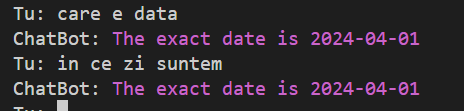
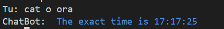
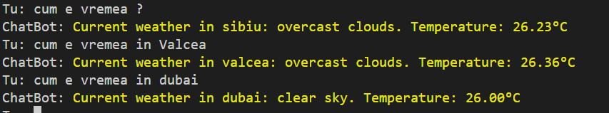

# ChatBot

This project is the project for the college subject "Artificial Intelligence"


## About

This project contains 3 files:
- knowledge.json
- ChatBot.py
- test-API.py


In the ChatBot.py file is the source code of the bot, where it has the "ability" to answer questions that are stored in the json file, if they are not, it will store the answer if it will be given by the user.

In the test-API.py file we have made it possible for the user to communicate with the bot through the terminal window.

And in the knowledge.json file, here are all the questions and answers stored by the bot.

This project, in short, is a bot that learns from the user, if it doesn't know the answer, it makes you tell it the answer.


## How to Run ChaBot

Clone the project

```bash
  git clone https://github.com/Andrei6700/ChaBot.git
```

Go to the ChaBot  directory

```bash
  cd ChaBot
```

Install dependencies

```bash
  pip install
```

Start 

```bash
  python -u "``path``\ChatBot\ChatBot.py"
```

## How to Run test-API

```bash
  cd ChaBot
```

Start 

```bash
   python -u "`path`\ChatBot\test-API.py"
```

## Features

- Learn from you
- Answer your question
- answer matemathics basic problems
- to answer questions about the time
- answer questions about the date
- answer questions about the weather in the given city


## Examples for setting the cutoff

    I made some settings to be able to set a cutoff. The *cutoff* parameter ,is used to find close matches to a given string in a list of strings.


  The higher the cutoff value `(>0.6)`, the tighter the matches will beand if the word is not exactly as it is in the .json file it willnot know the answer.

  But the lower the value is `below 0.6`, the cuttof will have problemsfinding certain words and confusing them with other words that arestored.

  `The conclusion` I have drawn about the value to set for the cutoff is `0.6` where it represents a balance in string matching.


```py

    # -----------------0.5-----------------|
    # pune intrebarea :                    |                            
    # Tu: saLuT                            |                    
    # ChatBot: Salut                       |                         
    # Tu: saut                             |                   
    # ChatBot: Salut                       |                         
    # Tu: cae e data                       |                         
    # ChatBot:  salut                      |                           
    # Tu: care e data                      |                          
    # ChatBot:  salut                      |                           
    # Tu: care e ziua                      |                
    # ChatBot: Sincer nu iti stiu numele,..|
    # -------------------------------------|
    # -----------------0.6-----------------|
    # Tu: salt                             |                         
    # ChatBot:Salut                        |                          
    # Tu: saul                             |
    # ChatBot: Salut                       |
    # Tu: data                             |
    # ChatBot:  salut                      |
    # Tu: care e dati                      |
    # ChatBot: I don't know the answer to..|
    # ChatBot: Te rog să-mi spui răspunsu..|
    # Tu: skip                             |
    # Tu: ce zi e azi ?                    |
    # ChatBot: Pai bine, tu ? Cum mai e v..|
    # -------------------------------------|
    # -----------------0.7-----------------| 
    # Tu: salyt                            |
    # ChatBot: Salut                       |
    # Tu: sult                             |
    # ChatBot: I don't know the answer ... |
    # Tu: skip                             |
    # Tu: data                             |
    # ChatBot: I don't know the answer ... |
    # ChatBot: Te rog să-mi spui răspun... |
    # Tu:                                  |
    # -------------------------------------| 
    # -----------------0.8-----------------| 
    # Tu: salyt                            |
    # ChatBot: Salut                       |
    # Tu: sult                             |
    # ChatBot: I don't know the answer ... |
    # Tu: skip                             |
    # Tu: data                             |
    # ChatBot: I don't know the answer ... |
    # ChatBot: Te rog să-mi spui răspun... |
    # Tu:                                  |
    # -------------------------------------| 
    # -----------------0.9-----------------| 
    # Tu: saut                             |       
    # ChatBot: I don't know the answer t...|
    # ChatBot: Te rog să-mi spui răspuns...|
    # Tu: skip                             |    
    # Tu: salut                            |     
    # ChatBot: Salut                       | 
    # Tu: buna sala                        |
    # ChatBot: I don't know the answer t...|
    # ChatBot: Te rog să-mi spui răspuns...|
    # Tu:                                  |
    # -------------------------------------|

```

## Library

| Library   | Usage                                                                                      |
| --------  | ------------------------------------------------------------------------------------------ |
| Flask     | Used to handle incoming requests from customers.                                           |
| flask_cors| Used to enable inter-domain communication (CORS) between the test-API.py Flask server.     |
| json      |  Used to work with data in a .JSON file, loading and saving data.                          |
| difflib   |      Used to find closest matches between strings.                                         |
| re        |   Used to work with regular expressions, such as searching and replacing templates in text.|
| math      |   Used to perform mathematical operations.                                                 |
| dotenv    |  Used to load environment variables from an .env file into your application.               |
| os        |     Used to access the decryption key from another file.                                   |
| colorama  |    Used to color text in the terminal.                                                     |
| datetime  | Used to get the current date and time.                                                     |
| requests  |  Used to make HTTP requests to other servers to get weather data from the API.             |
---

## Screenshots






## Documentation
- https://realpython.com/python-ai-neural-network/
- https://www.create-learn.us/blog/how-to-make-ai-in-python-tutorial/
- https://www.geeksforgeeks.org/python-find-current-weather-of-any-city-using-openweathermap-api/