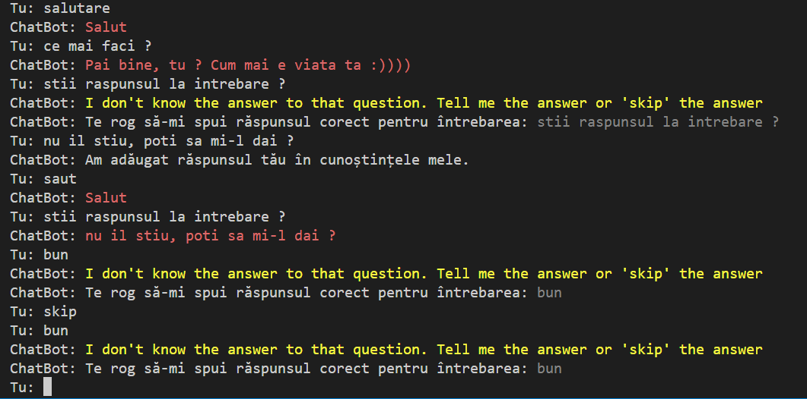

# ChatBot

This project is the project for the college subject "Artificial Intelligence"


## About

This project contains 3 files:
- knowledge.json
- ChatBot.py
- test-API.py


In the ChatBot.py file is the source code of the bot, where it has the "ability" to answer questions that are stored in the json file, if they are not, it will store the answer if it will be given by the user.

In the test-API.py file we have made it possible for the user to communicate with the bot through the terminal window.

And in the knowledge.json file, here are all the questions and answers stored by the bot.

This project, in short, is a bot that learns from the user, if it doesn't know the answer, it makes you tell it the answer.


## How to Run ChaBot

Clone the project

```bash
  git clone https://github.com/Andrei6700/ChaBot.git
```

Go to the ChaBot  directory

```bash
  cd ChaBot
```

Install dependencies

```bash
  pip install
```

Start 

```bash
  python -u "``path``\ChatBot\ChatBot.py"
```

## How to Run test-API

```bash
  cd ChaBot
```

Start 

```bash
   python -u "`path`\ChatBot\test-API.py"
```

## Features

- Learn from you
- Answer your question
- answer matemathics basic problems


## Documentation

[Documentation](https://realpython.com/python-ai-neural-network/)
[Documentation](https://www.create-learn.us/blog/how-to-make-ai-in-python-tutorial/)


## Screenshots


